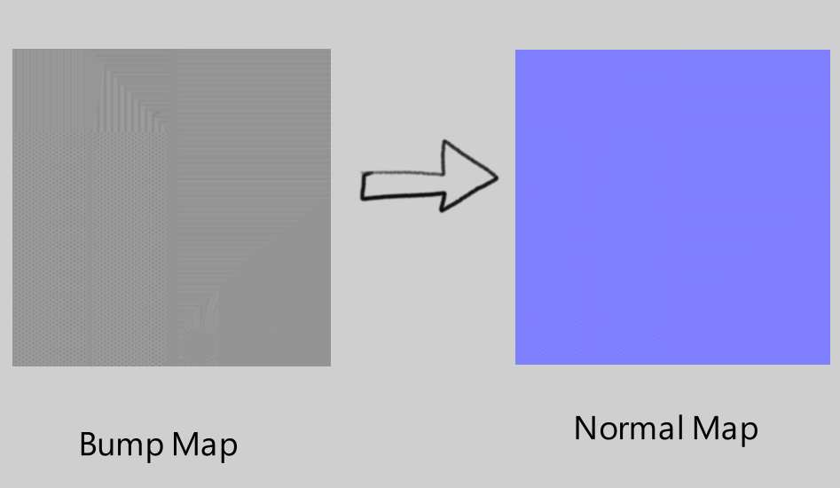

BUMPTONORMAL --- README
---

## Created by Muhammad Muneeb
### [Site (vacuity.online)](www.vacuity.online)
# Introduction
Artists use bump maps in 3ds to add surface detail to their models. This does not work well in some renderers.
To use a bump map in a PBR renderer, it has to either be converted into a normal map before adding it as an asset, or use a custom shader to convert it in real-time.
I was asked to facilitate in the first approach. I could not find the required functionality in 3ds, so I turned to 3rd party tools.
I found the source for GIMP's normal-map filter which achieved this result. This code scaled poorly, taking up to 2 minutes to convert a 1k resolution image. So, I turned to a shader approach, using the GPU to operate on the image.
The immediate approach was to use OpenGL. I have experience with OpenGL API in C++, and it does not scale very well. Even switching between different updates of Windows 10 breaks GLUT, the underlying windowing system. And since I don't have experience with Windows Forms, I chose pygame.
pygame currently breaks on Windows because of a recent update.
I went a step higher and chose to implement it in the Godot engine.
---
# Architecture
## How does it work?
The program takes an image, assigns it as the texture to a viewport. This viewport scales to the size of the image. This viewport has a custom shader built to use a Sobel filter to generate a normal map from a bump map.
The program then waits 3 frames, giving the GPU ample time to render high resolutions. Tested on a GTX 1660Ti, this program can generate 8k textures without struggle.
Then it takes a screenshot of the viewport and saves it to an image.

## Reference
`BumpToNormal \<input> \<output> \<strength>

`input`: Full path to the input bump map.

`output`: Full path to the export image (should not previously exist depending on shell rights).

`strength`: Strength of the sobel filter, higher values mean stronger details

## Main
The main scene, called InputImage, is as:
Node2D>ShaderToImage
Where ShaderToImage is a custom scene, more on that later

The entry point of the program is the script UseShaderToImage.gd
It expects a _Material_ property to be set in the Inspector, this will be applied to the input image.
For our purposes _Material_ is a simple shader material with BumpToNormal as its shader.
On initialization of the scene, it reads the commandline arguments, binds _\_on\_ShaderToImage\_generated()_ to the signal emitted when ShaderToImage is sure that the image is generated and sets up some image properties and variables. On the second frame, it asks ShaderToImage to generate the image.

## Shader To Image
A helper to render Image with Godot (Tested on 3.2). It use tricks with viewport and image rendering.
It's usefull because you can generate thing GPU side then use them CPU side and because godot doesn't have easy way to get a Texture to an Image POST shading.

## How to use
Instance the scene ShaderToImage.tscn in your current scene.
Then generate the Image :
```
my_material = load("some_material_path.material")
shader_to_image.generate_image(my_material) # Start generating the image
yield(shader_to_image, "generated") # Wait for the image to be rendered, it take 3 frams
var my_image = shader_to_image.get_image()
```

## Reference
```
func generate_image(material : Material, resolution := Vector2(512,512), multiplier := 1.0, args := {}):
```
Generate the new image. It is avaiable only when the Signal "generated" is emited.
- material (Material) : the material you want to render
- resolution (Vector2) : the final Image resolution, it can be passed to your shader as a uniform
- multiplier (float) : if you have an uniform it will "zoom in" "zoom out" on your shader will keeping the output resolution
- args (Dictionary) : You can pass argument to the uniform of the shader with a Dictionary. Ex : `{"time": 50.2, "mod1" : 0.8, "mod2" : 0.45}`

```
func get_image() -> Image:
```
Return the image reference, if no image have been generated return null and print an error

### Signal
```
signal generated
```
Signal emited everytime an image is generated. (It need 3 frames to be generated)

### Shader Uniform
```
uniform vec2 resolution
```
Add it to your shader to handle the surface resolution, it will take the value from the value `resolution*multiply` from generate_image function


---
# How to modify the binary?
To open the project, you need the mono version of the Godot binary, version >3.5, version<4. Additionally, you need the export template for windows-mono to create a new binary.
You should keep _Export Debug_ option on, as it will tell you what went wrong and will tell you which settings to change in export settings to make it run on your Windows version.

# The PCK file is necessary. It should stay in the same directory as the binary and should not be renamed